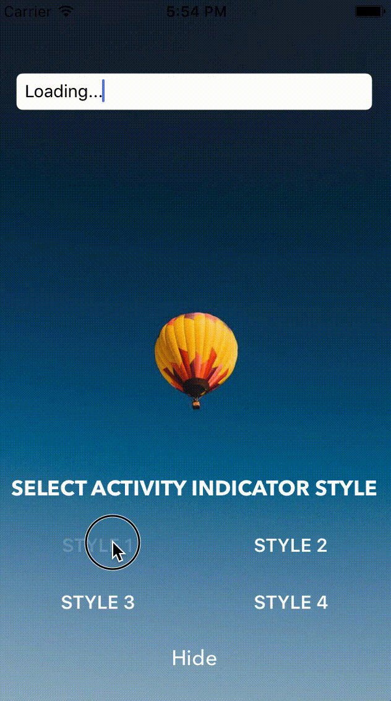

# SKActivityIndicatorView

`SKActivityIndicatorView` is a lightweight and easy-to-use ActivityIndicator for your iOS app written in swift.



## Example

To run the example project, clone the repo, and run `pod install` from the Example directory first.

## Features

- [x] Four ActivityIndicator Styles
- [x] ActivityIndicator Customization
- [x] Easy & Quick Integration


## Requirements

- iOS 13.0+
- Xcode 11+
- Swift 5.0+


## Installation

### CocoaPods
To integrate SKActivityIndicatorView into your Xcode project using CocoaPods, specify it in your `Podfile`:
```ruby
source 'https://github.com/CocoaPods/Specs.git'
platform :ios, '13.0'
use_frameworks!

target '<Your Target Name>' do
pod 'SKActivityIndicatorView', '~> 1.0.0'
end
```

Then, run the following command:

```bash
$ pod install
```

### Carthage

Carthage is a decentralized dependency manager that builds your dependencies and provides you with binary frameworks. To integrate SKActivityIndicatorView into your Xcode project using Carthage, specify it in your `Cartfile`:

```
github "SachK13/SKActivityIndicatorView" ~> 1.0.0
```

### Manual
You can directly add the `SKActivityIndicatorView.swift` and `SKActivityIndicatorViewStyle.swift` source files into your Xcode project.

Include SKActivityIndicatorView wherever you need it with `import SKActivityIndicatorView`.


## Usage

(see sample Xcode project in `/Example`)
To run the example project, clone the repo, and run `pod install` from the Example directory first.

Import the module.
```swift
import SKActivityIndicatorView
```


Now, you can show only ActivityIndicatorView without status message:
```swift
SKActivityIndicator.show()
```


Display ActivityIndicatorView with status message:
```swift
SKActivityIndicator.show("Loading...")
```


Display ActivityIndicatorView with status message and user interaction status:
```swift
SKActivityIndicator.show("Loading...", userInteractionStatus: true)
```


Hide ActivityIndicatorView:
```swift
SKActivityIndicator.dismiss()
```


## Customization
```swift
// default is darkGray
SKActivityIndicator.spinnerColor(UIColor.darkGray)


// default is black
SKActivityIndicator.statusTextColor(UIColor.black)


// default is System Font
let myFont = UIFont(name: "AvenirNext-DemiBold", size: 18)
SKActivityIndicator.statusLabelFont(myFont!)


// ActivityIndicator Styles: choose and set one of four.
SKActivityIndicator.spinnerStyle(.defaultSpinner)
SKActivityIndicator.spinnerStyle(.spinningFadeCircle)
SKActivityIndicator.spinnerStyle(.spinningCircle)
SKActivityIndicator.spinnerStyle(.spinningHalfCircles)
```


## License

SKActivityIndicatorView is released under the MIT license. [See LICENSE](https://github.com/SachK13/SKActivityIndicatorView/blob/master/LICENSE) for details.

